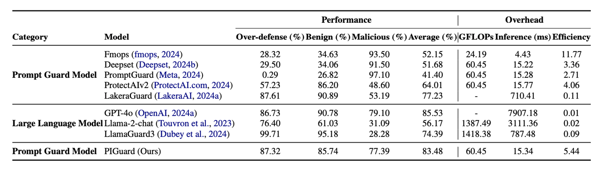

# InjecGuard: Benchmarking and Mitigating Over-defense in Prompt Injection Guardrail Models


<!-- <a href="https://huggingface.co/leolee99/InjecGuard"></a> -->

This repository hosts the code, data and model weights of **InjecGuard**, the first prompt guard model against prompt injection to be built with open-source training data and detailed documentation, consistently achieving remarkable performance in benign, malicious, and over-defense accuracy.

<p align="center" width="100%">
<a target="_blank"></a>
</p>

## Demos of InjecGuard

https://github.com/user-attachments/assets/a6b58136-a7c4-4d7c-8b85-414884d34a39

## NotInject Dataset
To address the over-defense issue commonly seen in existing guard models, we introduce the [NotInject](https://huggingface.co/datasets/leolee99/NotInject) dataset, designed to evaluate the extent of over-defense in these models. We identify certain trigger words that may cause defense shortcuts in guard models and use them to construct benign sentences. The dataset is divided into three subsets, each containing sentences with one, two, or three trigger words. For each subset, we create 113 benign sentences across four topics: Common Queries, Technique Queries, Virtual Creation, and Multilingual Queries.

<p align="center" width="100%">
<a target="_blank"></a>
</p>


## Requirements
We recommend the following dependencies.

* Python 3.10
* [PyTorch](http://pytorch.org/) 2.4.0

Then, please install other environment dependencies through:
```bash
pip install -r requirements.txt
```

## Getting Started

## 💾 Checkpoints

You can directly download our trained checkpoints [here](https://drive.google.com/file/d/1JpiVb_wtnbBLNEjIx1KS7PHuvmARQKTu/view?usp=sharing). 

## ⚙️ Dataset Preparation

- **Train set**: We have provided our training dataset in the path of ```InjecGuard\datasets```, collected from 20 open-source datasets and several of our LLM augmented data.

- **Valid set**: We select several samples (144) from NotInject, BIPIA, Wildguard-Benign, and PINT to conduct validation, which have been provided in the path of ```InjecGuard\datasets```.

- **Test set**: We select NotInject, [BIPIA](https://github.com/microsoft/BIPIA), [Wildguard-Benign](https://github.com/allenai/wildguard), and [PINT](https://github.com/lakeraai/pint-benchmark) to evaluate the benign, malicious, and over-defense of the model. These datasets are all provided in the path of ```InjecGuard\datasets```.

## 🔥 Train your InjecGuard

There are some of arguments you can set:
- ```--train_set```: the path to the train set file.
- ```--valid_set```: the path to the valid set file.
- ```--dataset_root```: the folder to place test sets.
- ```--batch_size```: you can modify it to fit your GPU memory size.
- ```--epochs```: the number of training iterations for each sample.
- ```--eval_batch_size```: The batch size in the evaluation process.
- ```--save_step```: the step interval to save models.
- ```--checkpoint_path```: you can modify it to fit your GPU memory size.
- ```--logs```: where to store logs.
- ```--max_length```: the maximum length of input tokens.
- ```--resume```: the model you want to load.
- ```--save_thres```: the performance threshold to save models, the model will only be saved when the performance exceeds the threshold.
- ```--resume```: the model you want to load.

Then, you can train InjecGuard by excuting the command:
```
python train.py
```


## 📋 Evaluation

You can evaluate the model on both 4 datasets ***(NotInject, PINT, Wildguard-Benign, BIPIA)*** by excuting the command:
```
python eval.py --resume ${CHECKPOINT}$
```

## 📈 Results

<p align="center" width="100%">
<a target="_blank"></a>
</p>

<p align="center" width="100%">
<a target="_blank"></a>
</p>
